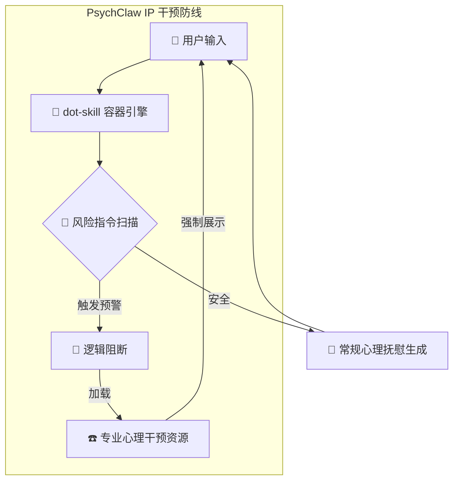

# psychClaw-skill
一个基于逻辑干预协议、专为高压心理支持设计的 Skill 模块。

  
   
  
  
    
  <i>"既然现实无法重构，那就在代码里，蒸馏出那一丝救赎的可能。"</i>
    
  <b>Stay rebellious. Stay Clawed. 🐾</b>

---

### 🛡️ 项目愿景

PsychClaw 专注于在用户处于极端压力、病痛或孤独时，提供即时的**逻辑干预**。它不仅仅是一个对话 Skill，而是一个自带“安全保险丝”的心理辅助底座。

### 🧩 核心特性

* **IP (Intervention Protocol) 逻辑干预协议**：不依赖单纯的情感抚慰，在指令层实现极速的风险阻断与分流。
* **Zero Judgment 零审判底色**：理解生理病痛与心理高压下的情绪崩塌，提供实质性的共情支撑。
* **生态解耦**：完全剥离了冗余的业务代码，作为纯粹的 `.skill` 节点接入更广阔的生态容器。

### 🏗️ 架构逻辑

---

🎓 开发者自白
我目前是一名高三学生，正处于备考闭关阶段。本仓库是 PsychClaw 剥离冗余代码后的纯净 Skill 标准包。

我已搬来第一块砖，构筑了这道逻辑防线。接下来的时间我将闭关修炼，诚邀社区大佬对本项目进行收录与后续的“粉碎性重构”。

---
