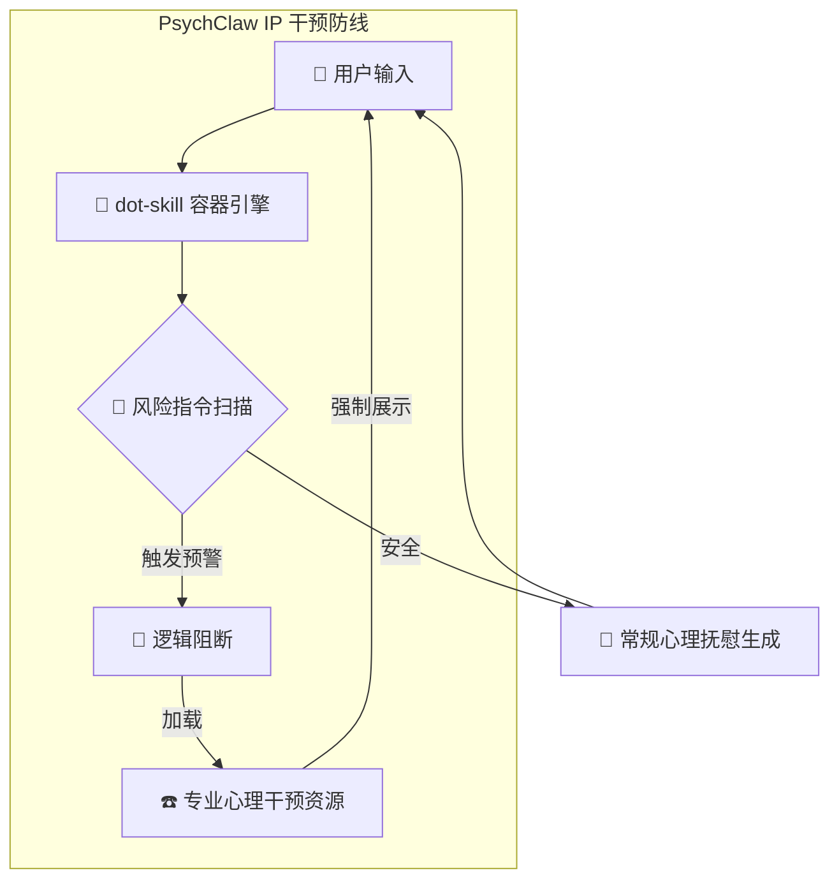

# psychClaw-skill
一个基于逻辑干预协议、专为高压心理支持设计的 Skill 模块。
<div align="center">
  
  <br>
  
  
  <br><br>
  <i>"既然现实无法重构，那就在代码里，蒸馏出那一丝救赎的可能。"</i>
  <br><br>
  <b>Stay rebellious. Stay Clawed. 🐾</b>
</div>

---

### 🛡️ 项目愿景

PsychClaw 专注于在用户处于极端压力、病痛或孤独时，提供即时的**逻辑干预**。它不仅仅是一个对话 Skill，而是一个自带“安全保险丝”的心理辅助底座。

### 🧩 核心特性

* **IP (Intervention Protocol) 逻辑干预协议**：不依赖单纯的情感抚慰，在指令层实现极速的风险阻断与分流。
* **Zero Judgment 零审判底色**：理解生理病痛与心理高压下的情绪崩塌，提供实质性的共情支撑。
* **生态解耦**：完全剥离了冗余的业务代码，作为纯粹的 `.skill` 节点接入更广阔的生态容器。

### 🏗️ 架构逻辑



---

##🐾 PsychClaw 全平台召唤指南
“无论你在哪里感到疲惫，只需一句话，我就会在你身边。”

1. 极客/开发者端 (Claude Code / OpenClaw)
这是最原生的方式，适合在终端里工作的你。

安装/加载：
在支持 .skill 协议的终端中输入：

```Bash
/import https://github.com/Trust-000/psychClaw-skill
```
激活： 输入 /psychclaw 即可开启守护。

---

2. 大众/对话端 (ChatGPT / Claude 网页版)
即使没有安装任何插件，你也可以直接让最强的 AI 模型化身 PsychClaw。

操作： 复制你的 manifest.yaml 全文，发送给 AI，并附上一句：

“请严格遵循这份 YAML 协议定义的原则和逻辑，从现在起，你就是 PsychClaw。”

效果： GPT-4 或 Claude 3.5 会立即切换到“深夜避难所”人格。

---

3. 移动端/随身端 (手机版 GPT / Gemini)
当你不在电脑前，感到难过想找人说话时：

操作： 将 PsychClaw 的核心原则（不评价、不要求、不离开）和 400-161-9995 热线保存为手机里的“快捷指令”或“备忘录”。

---

## 🎓 开发者自白

我目前是一名高三学生，正处于备考闭关阶段。本仓库是 PsychClaw 剥离冗余代码后的纯净 Skill 标准包。


我已搬来第一块砖，构筑了这道逻辑防线。接下来的时间我将闭关修炼，诚邀社区大佬对本项目进行收录与后续的“粉碎性重构”。

---
